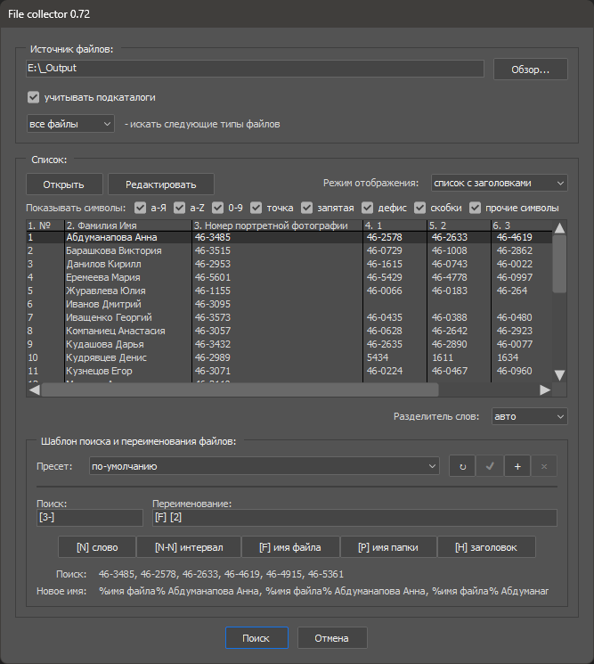
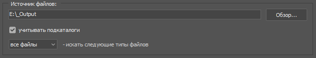
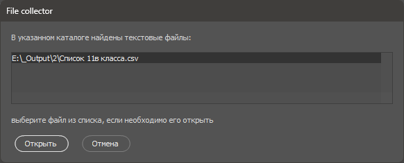
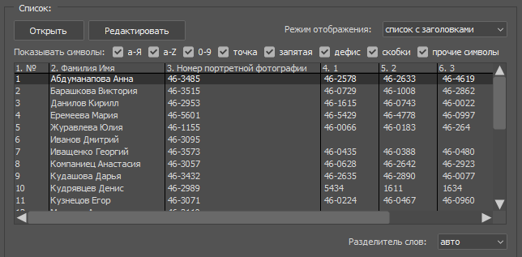
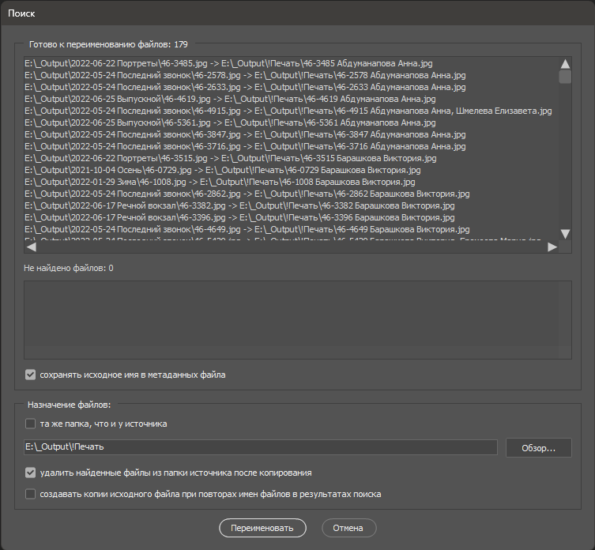

## File collector - cкрипт (jsx), предназначенный для поиска и переименования файлов на основании форматированного текстового списка.

Работает во всех версиях Adobe Photoshop серии Creative Cloud (начиная с CC 2014 (15 версии)), поддерживает Windows & OSX.

* [Установка](#Установка)
* [Интерфейс](#Интерфейс)
* [Модуль для Adobe Bridge](#Модуль-для-Adobe-Bridge)

## Установка

1. Скачайте файл [File collector.jsx](File%20collector.jsx), скопируйте его в папку Фотошопа `Presets\Scripts\`
2. Если Фотошоп запущен, перезапустите его. Скрипт появится в меню `Файл->Автоматизация`

## Интерфейс

### Панель `Источник файлов` позволяет указать папку в которой скрипт будет искать файлы.

Чтобы выбрать папку, нужно назать кнопку `Обзор...`. После этого скрипт получит список файлов по указанному пути.

Опция `учитывать подкаталоги` отвечает за поиск файлов во вложенных папках.
Список `искать следующие типы файлов` заполняется расширениями файлов после анализа выбранной папки и позволяет задать дополнительный фильтр по типу файлов.

Если в процессе анализа папки в указанной найдены текстовые файлы (TXT, CSV), то скрипт предложит их загрузить (файл можно открыть для предпросмотра двойным щелчком по строке списка).

### Панель `Список` предназначена для работы с форматированным текстовым списком.

Скрипт умеет работать с текстовыми данными стандарта CSV - данные располагаются в строках, столбцы отделены друг от друга разделителями. Пустрые строки игнорируются.

Список можно составить непосредственно в окне скрипта при помощи кнопки `Редактировать` (в том числе вставить  данные через буфер обмена из любого офисного приложения или браузера), либо загрузить с диска с помощью кнопки `Открыть`. Открыть можно только TXT или CSV файлы.

После загрузки списка ему можно задать один из двух `режимов отображения` - обычный `список` или `список с заголовками` (первая строка файла считается заголовком таблицы). Также можно задать параметры фильтрации символов в списке включая или выключая соответсвующие опции:

Если загруженный список точно соответствует стандарту CSV, то скрипт сам распознает тип используемых разделителей и в списке `Разделитель слов` можно оставить `авто`. Если данные в списке неструктурированы, то можно вручную указать тип разделителя полей (символ, который отделяет одно поле от другого).

После загрузки списка возможно редактирование отдельных строк - достаточно дважды щелнкуть мышкой по нужной строке.

### Для того, чтобы объяснить скрипту, как на основе содержимого полей списка найти и переименовать файлы, используется панель `Шаблон поиска и переименования файлов`

Принцип составления шаблонов предельно прост - в текстовых полях `поиск` и `переименование` указывается номер поля или интервала полей, которые нужно искать или вставить в новое имя файла. Номер поля можно увидеть в заголовке списка - скрипт добавляет их автоматически при загрузке. Номера полей нужно заключать в квадратные скобки, например `[1]` - первое слово текущей строки, `[2-3]` - второе и третье слово и т.п. Если для текущей строки слово не найдено - шаблон возвращает пустое значение. Для удобства все основные шаблоны подстановки продублированы кнопками - помимо вставки слова `[N]`, интервала `[N-N]` есть возможность вставить имя найденного файла `[F]`, имя папки в которой этот файл найден `[P]`, заголовок поля из которого было найдено имя файла `[H]` (шаблоны `[F],[P],[H]` предназначены только для строки переименования, в строке поиска они игнорируются).

Помимо шаблонов подстановки в строках поиска и переименования можно писать любой текст - в частности, поддерживается создание подкаталогов (для этого в строке переименования нужно указать символ-разделитель пути, например `JPG/[F] [1-2]` в строке переименования означает что в случае удачного поиска файла, в папке назначения будет создан каталог `JPG`, куда будет помещен переименованный по шаблону `[F] [1-2]` файл (т.е. имя исходного файла, пробел первое и второе слово из текущей строки).

> **Обратите внимание, шаблон `интервал` для полей `поиск` и `переименование` работает по-разному.**

В строке `переименование` он просто вставляет указанные слова (например, `[1-2]` - это первое и второе слово из текущей строки списка, `[1-]` с первого слова и до конца строки, `[-3]` - от начала строки и до третьего слова и т.п.), а в строке `поиск` он указывает диапазон отдельных полей для поиска. Т.е. если в строке `поиск` указать [1-2], то скрипт будет искать сначала файлы содержащие в имени слово `[1]`, а затем файлы в имени слово `[2]`, то есть фактически это будет два отдельных поисковых запроса. Например, если в списке есть строка `Петров Петя 060 052 035`, то указав в строке поиска интервал `[3-5]`, мы найдем три разных файла (содержащих 060, 052, 035 в имени соответственно). При поиске скрипт находит все файлы, содержащие символы из шаблона, но выбирает из них только один - тот, имя которого меньше всего отличается от текста указаного в строке `поиск`. Чтобы работа скрипта была более предсказуемой, лучше создавать шаблоны поиска как можно более полно соответствующие именам файлов.

Панель `Шаблон поиска и переименования файлов`также позволяет сохранять настройки шаблонов в виде пресетов.

### При нажатии кнопки `Поиск` осуществляется последовательная обработка всех полей списка и поиск по указанному шаблону файлов из указанной папки.

В результате поиска выводятся два списка - список файлов готовых к переименованию (в формате “найденный файл” -> “новое имя файла”) и список строк, для которых не удалось обнаружить соответствие.

В процессе поиска проверяется уникальность имени каждого файла - если в результате поиска у переименованных файлов будут одинаковые имена, то они автоматически переименуются.

Панель `Назначение файлов` позволяет указать куда копировать или переместить (при включенной опции удалить `найденные файлы из папки источника после копирования`) найденные файлы.

Опция `сохранять исходное имя в метаданных файла` позволяет сохранить исходное имя файла в поле `PreservedFileName`и впоследствии [восстановить его](https://github.com/boogalooper/Snippets/blob/master/Bridge/Bridge%20-%20get%20back%20preserved%20filenames.jsx).

Опция `создавать копии исходного файла при повторах имен файлов в результатах поиска` отвечает за логику работы с дубликатами файлов (когда на один и тот же файл ссылаются несколько полей из списка). Если опция включена - то скрипт создает и переименовывает копии исходного файла по количеству его упоминаний в списке. Если отключена - создается только одна копия, а в имени файла через запятую указываются имена всех копий.

## Модуль для Adobe Bridge

С помощью дополнительного модуля после установки в Фотошоп скрипт может быть вызыван из Бриджа (запускает скрипт, передает путь к папке открытой или выбранной в бридж). Для этого нужно скопировать файл [File collector for Bridge.jsx](File%20collector%20for%20Bridge.jsx)

В Windows:
`C:\Program Files\Common Files\Adobe\Startup Scripts CC\Adobe Photoshop`
в macOs:
`/Users/yourUser/Library/Application Support/Adobe/Bridge CC/Startup Scripts`

Также в обоих системах допустим такой вариант:
`BridgeFolder/Scripts/Startup Scripts`
`BridgeFolder/Startup Scripts`

