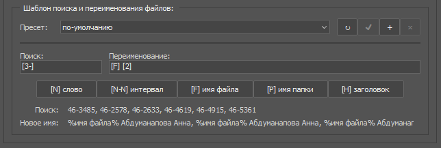

## File collector - cкрипт (jsx), предназначенный для поиска и переименования файлов на основании форматированного текстового списка.

Скрипт работает во всех версиях Adobe Photoshop серии Creative Cloud (начиная с CC 2014 (15 версии)), поддерживает Windows & OSX.

### Панель `Источник файлов` позволяет задать папку в которой скрипт будет искать файлы из списка.

Чтобы выбрать папку, нужно назать кнопку `Обзор...`. После этого скрипт получит список файлов по указанному пути.

Опция `учитывать подкаталоги` отвечает за поиск файлов во вложенных папках.
Список `искать следующие типы файлов` заполняется расширениями файлов после анализа выбранной папки и позволяет задать дополнительный фильтр по типу файлов.

Если в процессе анализа папки в указанной найдены текстовые файлы (TXT, CSV), то скрипт предложит их загрузить (файл можно открыть для предпросмотра двойным щелчком по строке списка).

### Панель `Список` предназначена для работы с форматированным текстовым списком.

Скрипт умеет работать с текстовыми данными стандарта CSV - данные располагаются в строках, столбцы отделены друг от друга разделителями.

Список можно составить непосредственно в окне скрипта при помощи кнопки `Редактировать` (в том числе вставить  данные через буфер обмена из любого офисного приложения или браузера), либо загрузить с диска с помощью кнопки `Открыть`. Открыть можно только TXT или CSV файлы.

После загрузки списка ему можно задать `Режим отображения` - обычный `список` или `список с заголовками` (первая строка файла считается заголовком). Также можно задать параметры фильтрации символов в списке включая или выключая соответсвующие опции

Если загруженный список точно соответствует стандарту CSV, то скрипт сможет сам распознать тип используемых разделителей и в списке `Разделитель слов` можно оставить `авто`. Если данные в списке неструктурированы, то можно вручную указать тип разделителя данных (символ, который отделяет одно поле от другого).

После загрузки списка возможно редактирование отдельных строк - достаточно дважды щелнкуть мышкой по нужной строке.

Скрипт ищет файлы из списка и переименовывает их построчно (т.е. одна строка - это одна поисковая запись). Пустые строки игнорируются.

### Для того, чтобы объяснить скрипту, как на основе содержимого строки списка найти и переименовать файлы, используется панель “Шаблон поиска и переименования файлов”.

Принцип составления шаблонов предельно прост - в текстовых полях `поиск` и `переименование` указывается номер поля или интервала полей, которые нужно искать или вставить в новое имя файла. Номер поля можно увидеть в заголовке списка. Номера полей нужно заключать в квадратные скобки, например `[1]` - первое слово текущей строки, `[2-3]` - второе и третье слово и т.п. Если для текущей строки слово не найдено - шаблон возвращает пустое значение. Для удобства все основные шаблоны подстановки продублированы кнопками - помимо вставки слова `[N]`, интервала `[N-N]` есть возможность вставить имя найденного файла `[F]`, имя папки в которой этот файл найден `[P]`, заголовок поля из которого было найдено имя файла `[H]` (шаблоны `[F],[P],[H]` предназначены только для строки переименования, в строке поиска они игнорируются).

Помимо шаблонов подстановки в строках поиска и переименования можно писать любой текст - в частности, поддерживается создание подкаталогов (для этого в строке переименования нужно указать символ-разделитель пути, например `JPG/[F] [1-2]` в строке переименования означает что в случае удачного поиска файла, в папке назначения будет создан каталог `JPG`, куда будет помещен переименованный по шаблону `[F] [1-2]` файл (т.е. имя исходного файла, пробел первое и второе слово из текущей строки).

> Обратите внимание, шаблон `интервал `для полей `поиск` и `переименование` работает по-разному.

В строке `переименование` он просто вставляет указанные слова (например, `[1-2]` - это первое и второе слово из текущей строки списка, `[1-]` с первого слова и до конца строки, `[-3]` - от начала строки и до третьего слова и т.п.), а в строке `поиск` он указывает диапазон отдельных полей для поиска. Т.е. если в строке `поиск` указать [1-2], то скрипт будет искать сначала файлы содержащие в имени слово `[1]`, а затем файлы в имени слово `[2]`, то есть фактически это будет два отдельных поисковых запроса. Например, если в списке есть строка `Петров Петя 060 0`52 035, то указав в строке поиска интервал `[3-5]`, мы найдем три разных файла (содержащих 060, 052, 035 в имени).
При поиске скрипт находит все файлы, содержащие слова из шаблона, но выбирает из них только один - тот, имя которого меньше всего отличается от текста указаного в строке `поиск`. Чтобы работа скрипта была более предсказуемой, лучше указать имена как можно более полно, например, шаблон `IMG_[3-5]`, найдет три файла, которые будут содержать текст `IMG_060`, `IMG_052`, `IMG_035`.

При нажатии кнопки `Поиск`осуществляется полная обработка всех строк списка и поиск по указанному шаблону файлов указанного источника, после чего выводятся два списка - список найденных файлов (в формате “найденный файл” -> “новое имя файла”) и список строк, для которых не удалось обнаружить соответствие. В процессе поиска проверяется уникальность имени каждого файла - если в результате поиска у переименованных файлов будут одинаковые имена, то они автоматически переименуются.

Панель “Назначение файлов” позволяет указать куда копировать или переместить (при включенной опции “удалить найденные файлы из папки источника после копирования”) найденные файлы. Если целевая папка уже содержит файлы с такими же именами, то новые файлы не копируются поверх имеющихся

